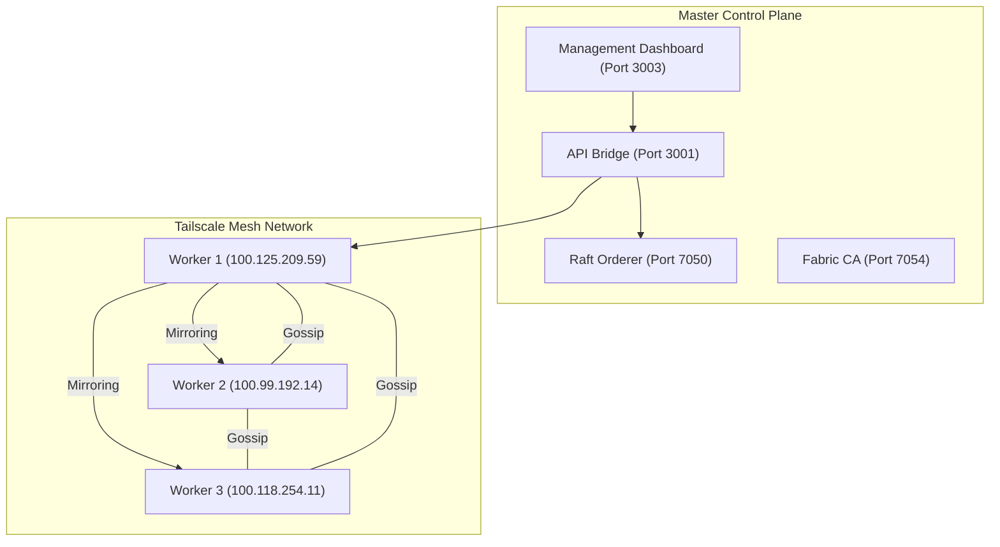

# Distributed Fabric Document Storage Mesh

A robust, 3-node decentralized document storage system built on Hyperledger Fabric, Minio, and Tailscale.

## Architecture Overview



## Features
- **3-Node Distributed Ledger**: Fully synchronized Fabric peers across three independent containers.
- **Replicated Object Storage**: Multi-site Minio mirroring ensures data consistency across the entire mesh.
- **Unified Management**: Real-time dashboard for monitoring health, efficiency, and ledger activity.
- **Secure Networking**: All inter-node traffic is encrypted via Tailscale sidecars.

## Quick Start (Unified Access)
Access each worker's Minio console directly:
- **Worker 1**: [http://localhost:9000](http://localhost:9000)
- **Worker 2**: [http://localhost:9001](http://localhost:9001)
- **Worker 3**: [http://localhost:9002](http://localhost:9002)

*Dashboards: `http://localhost:3000` (Frontend), `http://localhost:3001` (API)*

## Distributed Deployment Guide (Remote Workers)

To deploy worker nodes on separate machines (e.g., college PCs):

1.  **Clone this Repo on the Worker PC**:
    ```bash
    git clone <your-repo-url>
    cd fabric-master
    ```
2.  **Initialize the Worker**:
    Pass the assigned worker ID (e.g., `fabric-worker-2`) and optionally a Tailscale Auth Key.
    ```bash
    ./scripts/setup-worker.sh fabric-worker-2 <OPTIONAL_TS_AUTHKEY>
    ```
3.  **Final Synchronization**:
    Once the worker is up and authenticated on Tailscale, run the discovery script on the **Master Laptop**:
    ```bash
    ./scripts/collect-ips.sh
    ```
    Update `config/master.env` with the discovered IPs to enable full orchestration.

---

## Documentation
- [Master Implementation Details](implementation-master.md)
- [Worker Implementation Details](implementation-worker.md)
- [Deployment Walkthrough](docs/walkthrough.md)
